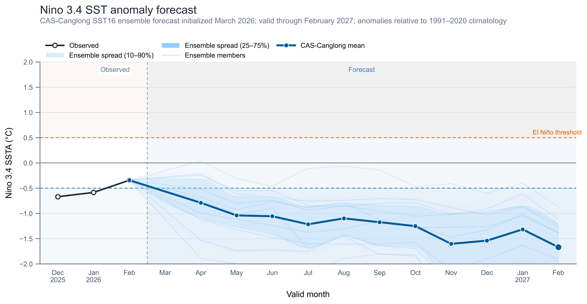
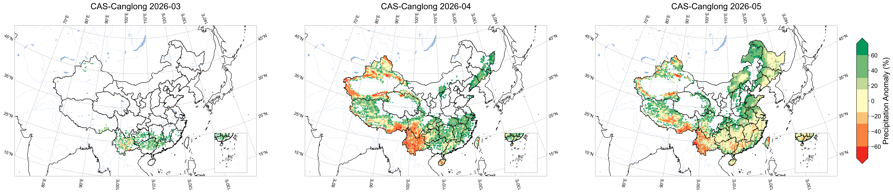
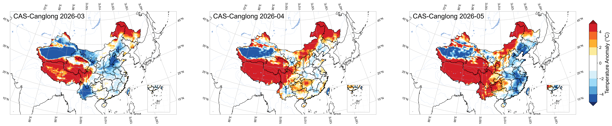
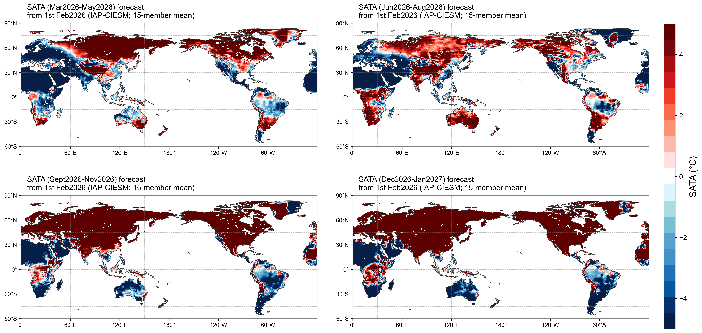
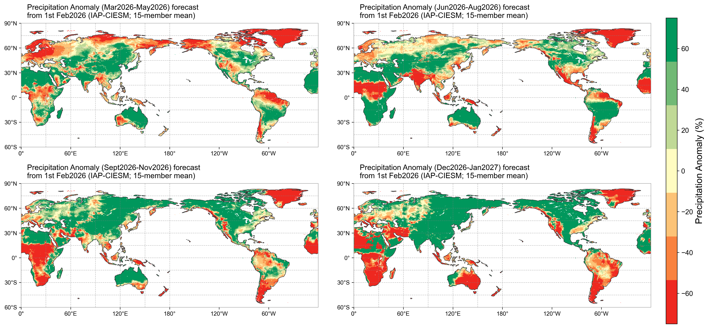

预报产品信息：本次 CAS-Canglong 业务产品的大气起报时间为2026年3月5日，预报至2026年12月31日；海洋部分采用 CAS-Canglong SST16 海温预测结果，初始化于2026年3月，预测至2027年2月。大气部分基于 CAS-Canglong v3full（本次业务使用 v3.5 权重）次季节—季节 AI 预报系统，使用前两周全球状态作为输入，按周滚动预测并汇总生成月尺度和季节尺度产品；海洋部分直接给出未来16个月的海表温度异常及 ENSO 相关指数预测。以下内容依据 `analysis/operation/output/20260305_v35_ft2_best/` 与 `analysis/operation/SSTmodel/` 下已经绘制的结果图整理而成。

说明：目前大气业务结果覆盖到2026年12月，因此文中的"DJ/冬季"图主要反映2026年12月的信号，而不是完整的2026年12月—2027年2月平均；另外，部分全球图题仍沿用旧模板中的英文模式名，但对应数据均来自本次 CAS-Canglong 业务结果。

# ENSO预测
从 Niño3.4 指数预测来看，2026 年 3 月起赤道中东太平洋将快速转向冷异常。模式集合平均预计 3 月 SSTA 约 -0.3°C，4 月即跌破 -0.5°C 的拉尼娜阈值，5—6 月进一步降至 -1.0°C 附近并持续维持；夏秋季（7—10 月）冷异常在 -1.0 至 -1.3°C 之间波动，10 月集合平均达到 -1.3°C；进入冬季后（11—12 月），冷异常进一步加深至 -1.5 至 -1.6°C，为全年最强阶段。2027 年 1—2 月冷异常仍在 -1.3 至 -1.7°C 之间，未见明显减弱。集合不确定性在前期较小（3 月 STD ≈ 0.5°C），冬季略有增大（11 月 STD ≈ 0.8°C），但 10 个集合成员全部维持在负值区间，无一发展为暖事件。整体上，本次预报明确支持 **2026 年发展为一次中等偏强拉尼娜事件** 的判断，且持续时间较长，预计至少延续到 2027 年初。

# 我国降水预测
月尺度结果显示，2026 年 3 月我国降水偏多信号主要分布在华北、黄淮、东北南部及长江中游一带，而西南部分地区和华南沿海有局地偏少；4 月偏多区域进一步扩大并北移，东北大部、华北和黄淮维持偏多，华南、江南南部逐步转为偏多或接近常年；5 月偏多中心集中在东北、华北以及江淮一带，而西北西部和青藏高原部分地区偏少。总体看，春季我国降水以北方偏多为主要特征。

季节尺度上，2026 年春季（MAM）我国降水呈现"大范围偏多、西南和华南东部局地偏少"的格局，华北、东北、黄淮及长江中下游偏多显著，尤其东北和华北偏多幅度较大（+20%至+60%），西南局地和华南东南沿海存在偏少信号；2026 年夏季（JJA）降水分布转为南北分化，华南和江南大部偏多较明显，华北、东北和西北偏少，华东沿海偏少突出，需关注华北—东北阶段性高温少雨风险；2026 年秋季（SON）全国大部降水接近常年或略偏多，华南和西南偏多较显著，华北北部和东北有偏少带；初冬阶段（当前图主要代表 2026 年 12 月）全国大部接近常年，仅华南和西南局地有弱偏多信号。

# 我国气温预测
月尺度结果表明，2026 年 3 月全国大部以偏暖为主，偏暖中心位于东北、华北、内蒙古及长江中下游，青藏高原和西北西部存在明显偏冷信号（偏冷 1—3°C）；4 月偏暖范围明显扩大，全国绝大部分地区偏暖，西北西部和青藏高原偏冷减弱但仍有信号；5 月全国大范围偏暖维持，偏暖中心北移至华北和东北，青藏高原逐步转为接近常年。整体而言，春季我国以偏暖背景为主，但西北—青藏高原区域需注意阶段性偏冷。

季节尺度结果显示（已应用偏差校正），2026 年春季（MAM）全国呈现"东暖西冷"的空间格局，华东、华中、华南和东北普遍偏暖 1—3°C，而青藏高原和新疆西部偏冷 1—2°C，这一分布与拉尼娜背景下东亚大陆偏暖、高原偏冷的典型模态较吻合；2026 年夏季（JJA）北方和西部维持偏暖，华北、东北偏暖较强，而华东南部和江南出现较清楚的偏冷带（偏冷 1—2°C），形成"北暖南冷"的反差，说明夏季热力分布存在较大空间差异；2026 年秋季（SON）全国大部接近常年或略偏暖，华北和东北有弱暖异常，青藏高原和西南局地接近常年或偏冷，整体偏暖幅度较春夏明显减小；初冬阶段（当前图主要代表 2026 年 12 月）全国大部偏暖，偏暖中心位于华北和东北（+1 至 +3°C），南方偏暖幅度较小，与拉尼娜冬季"前冬偏暖"的统计特征一致。

# 干旱预测（SPEI-4）
未来 6 周（2026 年 3 月 5 日至 4 月 15 日）SPEI-4 结果显示，3 月上旬我国西北和青藏高原中东部存在较明显的偏干信号（SPEI-4 < -1），而东部大部分地区以偏湿为主；3 月中下旬偏湿范围从东部逐步扩大至全国大部，西北偏干信号减弱但仍维持；进入 4 月后，全国绝大部分地区偏湿信号增强，华南、江南、华北以及东北均呈现显著偏湿（SPEI-4 > 1），仅新疆南部和青藏高原西部局地仍有偏干信号。整体来看，未来 6 周我国东部和南方大部干旱风险较低，需重点关注西北内陆和高原西部的持续偏干。

## 全球海表温度异常预测
海温预测结果显示，2026 年春季至冬季，赤道中东太平洋持续存在明显的冷异常，春季即开始发展、夏秋进一步增强，冬季达到峰值，冷异常中心位于赤道东太平洋（Niño3 和 Niño3.4 区域），这与上述 ENSO 预测完全一致。与此同时，北太平洋中高纬维持暖异常，北大西洋中高纬也普遍偏暖；印度洋大部以暖异常为主，南半球中高纬海域偏暖背景维持。赤道太平洋冷异常与周边海域暖异常的对比在秋冬最为显著，形成典型的拉尼娜海温分布型。

## 全球地表气温异常预测
全球陆地气温异常结果表明，2026 年春季北半球大陆大部偏暖，中亚—西伯利亚、北美高纬和欧洲暖异常尤为明显，而青藏高原和中亚部分山地存在偏冷区域；夏季北半球中高纬大范围偏暖进一步增强，亚洲北部、欧洲和北美均呈现显著暖异常，但东南亚、南亚和非洲赤道附近部分地区偏冷或接近常年；秋季全球陆地以偏暖为主，暖异常范围和强度均达到全年最大；冬季（12 月）全球大陆大范围偏暖维持，北半球中高纬暖异常尤其显著。总体来看，2026 年全球陆地温度异常以持续偏暖为主导背景，拉尼娜的冷却效应主要体现在热带太平洋和周边局地。

## 全球降水异常预测
全球陆地降水异常预测显示，2026 年春季欧亚大陆中高纬大范围偏多，东亚、东南亚和北美中部也以偏多为主，而地中海周边、中东和北非偏少；夏季中高纬偏多格局维持，东亚偏多较显著，而澳大利亚、非洲南部和南美南部偏少；秋季北半球中高纬偏多降水范围进一步扩大，热带非洲和南美北部偏多，而南美南部和澳大利亚仍有偏少；冬季（12 月）北半球大部偏多维持，热带地区降水分布呈现与拉尼娜一致的特征——赤道太平洋沿岸偏少、印太暖池区域偏多。

## 大气环流异常预测（850 hPa）
850 hPa 低层环流结果显示，2026 年春季北太平洋和北大西洋中高纬存在较强负高度异常，赤道太平洋附近也有负异常带，与拉尼娜背景下 Walker 环流增强一致；夏季东亚—西北太平洋一带低层正高度异常发展，南亚—东南亚季风区风场异常较活跃，反映季风环流和副热带高压的季节性调整；秋冬阶段，北半球中纬度出现大范围正高度异常，尤其欧亚大陆和北太平洋中高纬正异常显著增强，说明冬半年低层暖脊活跃、与我国北方偏暖背景呼应。

## 大气环流异常预测（500 hPa）
500 hPa 中层环流显示，春季欧亚大陆中高纬以正高度异常为主，北太平洋中部存在负异常中心；夏季北半球中高纬正异常进一步增强，西太平洋副高区域正异常突出，红线（预报态 5880 gpm 线）较蓝线（气候态）位置偏北偏西，提示副高可能偏强偏北；秋冬阶段，北半球中高纬大范围正高度异常持续增强，极区附近负异常减弱，反映出经向环流和阻塞形势活跃的信号。500 hPa 中层正高度异常在冬季最为显著，与拉尼娜背景下北半球中高纬偏暖、极涡偏弱的典型模态一致。

## 大气环流异常预测（200 hPa）
200 hPa 上对流层环流结果进一步表明，春季北半球中低纬存在较强正高度异常，而高纬（极区）负异常明显，上层西风急流偏强；夏季热带—副热带正异常扩展，北太平洋—北美一带负高度异常较清楚，高空波列活动较明显；秋冬阶段，北半球中高纬正异常带覆盖范围更广，高空急流位置和强度存在季节性调整，极区附近负异常在冬季再度增强。此类高空环流异常与中纬度天气过程活跃度、东亚冬季风强度及寒潮路径密切相关，拉尼娜背景下高空经向波列增强的信号值得关注。

其他说明：与所有气候预测一样，上述结果仍存在不确定性，特别是拉尼娜事件的强度和持续时间、夏季降水南北分化程度以及秋冬环流形势对海温异常的响应均较为敏感。本次预报中 ENSO 信号较强且集合一致性较高，但季节内变率和极端事件的时空分布仍需持续跟踪。建议将 CAS-Canglong 结果与实时观测、ECMWF 等其他模式产品结合起来综合研判。
